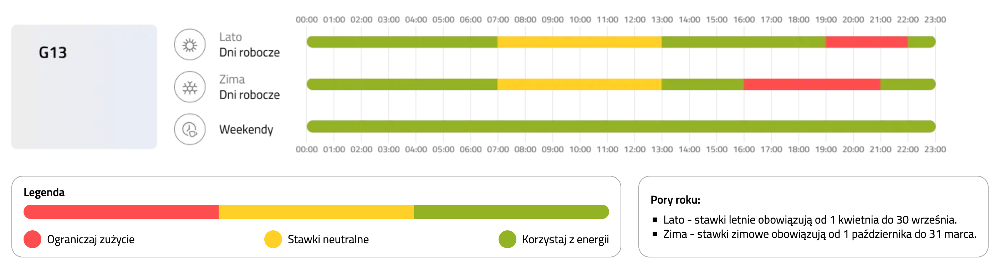

# Tauron G13 - widget dla urządzeń iOS (Scriptable)

Dynamiczny widget, który pomaga optymalizować zużycie prądu. Skrypt na bieżąco analizuje aktualną godzinę, dzień tygodnia oraz porę roku (taryfa letnia i zimowa), aby poinformować Cię, w jakiej strefie cenowej się obecnie znajdujesz.

Widget został zoptymalizowany pod kątem minimalnego zużycia baterii - odświeża się wyłącznie wtedy, gdy następuje zmiana strefy taryfowej.

## Zrzuty ekranu

|             Taryfa zielona (tania)              |            Taryfa żółta (neutralna)            |            Taryfa czerwona (droga)             |
| :---------------------------------------------: | :--------------------------------------------: | :--------------------------------------------: |
|  |  |  |

## Główne funkcje

- **Wizualny wskaźnik cen prądu**

  Kolor tła widgetu zmienia się automatycznie w zależności od aktualnej stawki.

- **Obsługa taryfy letniej i zimowej**

  Skrypt automatycznie przestawia godziny stref (np. wieczorny szczyt) w zależności od miesiąca.

- **Tryb weekendowy**

  Rozpoznaje piątkowy wieczór i utrzymuje tanią strefę przez cały weekend aż do poniedziałku rano.

- **Rekomendacje**

  Wyraźny tekst podpowiadający, czy to dobry moment na włączenie pralki lub zmywarki.

- **Szybkie uruchamianie aplikacji Tauron eLicznik (opcjonalnie)**

  Po kliknięciu w widget możesz automatycznie otworzyć aplikację Tauron eLicznik.

## Wymagania

- Urządzenie z systemem iOS lub iPadOS.
- Darmowa aplikacja [Scriptable](https://apps.apple.com/us/app/scriptable/id1405459188) pobrana z App Store.

## Instrukcja instalacji

1. Otwórz plik `dist/Tauron G13.js` na urządzeniu iOS. Tapnij ikonę `Udostępnij` i wybierz aplikację Scriptable, aby zaimportować skrypt.
2. Stuknij `+ Add to My Scripts`, a następnie `Done` w lewym górnym rogu.
3. Wróć na ekran główny, przytrzymaj palec na pustym miejscu (aż ikony zaczną drżeć), stuknij `Edytuj` w lewym górnym rogu i wybierz `Dodaj widżet`.
4. Znajdź na liście Scriptable, wybierz mały rozmiar widgetu i dodaj go na ekran stukając `+ Dodaj widżet`.
5. Stuknij w dodany widget, aby go skonfigurować. W polu `Script` wybierz zaimportowany wcześniej skrypt o nazwie `Tauron G13`.
6. Zakończ dodawanie widgetu, stukając `Gotowe` w prawym górnym rogu.

## Konfiguracja otwierania aplikacji Tauron eLicznik (opcjonalnie)

Jeśli chcesz, aby kliknięcie w widget otwierało aplikację Tauron eLicznik, wykonaj poniższe kroki przy użyciu systemowej aplikacji Skróty:

1. Otwórz aplikację Skróty na urządzeniu iOS.
2. Tapnij ikonę `+` w prawym górnym rogu, aby utworzyć nowy skrót.
3. Znajdź akcję `Otwórz aplikację` i wybierz ją.
4. Jako aplikację wybierz eLicznik, klikając u góry w wygaszony niebieski tekst `Aplikacja`.
5. Stuknij `Otwórz aplikację` u góry ekranu i zmień nazwę skrótu dokładnie na `eLicznik`.
6. Zapisz skrót stukając w ikonę `Wstecz`.
7. W kodzie skryptu w aplikacji Scriptable znajdź i odkomentuj (usuń `//`) poniższą linijkę na samym początku pliku:
   `const url = 'shortcuts://run-shortcut?name=eLicznik';`

## Grupa taryfowa G13

